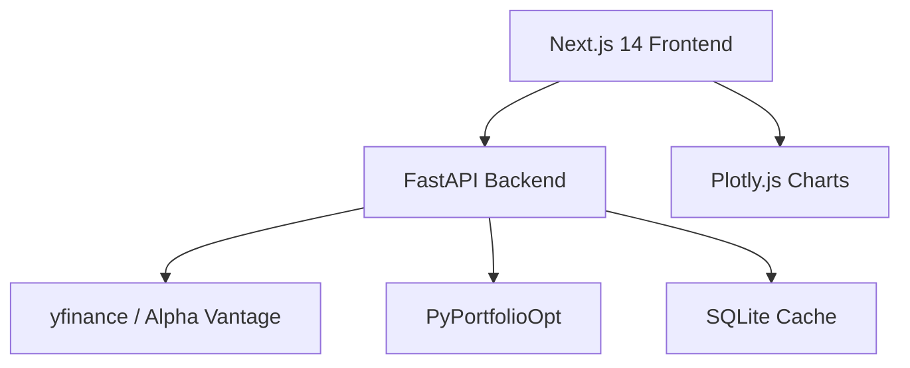

# Investment Command Center

**Professional-grade financial models. 12 AI analyzers. One dashboard.**


---

## The Problem

Portfolio analysis tools fall into two camps:

- **Consumer apps** (Robinhood, Yahoo Finance) give you a price chart and a P/E ratio. That is not analysis -- it is decoration.
- **Institutional platforms** (Bloomberg Terminal, Refinitiv) give you everything, for $25,000/year. Most individual investors will never justify that cost.

There is nothing in the middle -- a tool that runs real financial models (Monte Carlo, Markowitz optimization, dividend discount valuation) on real-time market data, with a clean interface, and costs nothing.

Investment Command Center fills that gap.

---

## What You Get

### Monte Carlo Simulation
Run 10,000-path probabilistic forecasts on any stock or portfolio. Each simulation uses historical volatility and drift to project a distribution of future outcomes -- not a single line, but a probability cone. See the median case, the 5th percentile worst case, and the 95th percentile best case. Know your range before you commit capital.

### Markowitz Portfolio Optimizer
Input your holdings and get back the efficient frontier -- the set of portfolios that maximize expected return for a given level of risk. Powered by PyPortfolioOpt, the optimizer calculates optimal weights using mean-variance optimization, minimum volatility, and maximum Sharpe ratio strategies. Stop guessing at allocation.

### Gordon Growth Model (DDM)
Dividend discount valuation with sustainability scoring. The model estimates intrinsic value based on current dividends, payout ratios, and projected growth rates. It flags unsustainable dividends before they get cut. Useful for income investors who want to know whether that 8% yield is real or a trap.

### Risk Analyzer
Quantitative risk metrics for any ticker or portfolio:
- **Sharpe Ratio** -- risk-adjusted return vs. the risk-free rate
- **Sortino Ratio** -- downside-only risk adjustment (penalizes losses, ignores upside volatility)
- **Value at Risk (VaR)** -- maximum expected loss at a given confidence level
- **Maximum Drawdown** -- largest peak-to-trough decline in portfolio history

### 5 Stock Scanners
- **Dividend Scanner** -- finds high-yield, sustainable-payout stocks
- **Emerging Tech Scanner** -- identifies momentum in technology sectors
- **Custom Screener** -- filter by any combination of fundamental and technical criteria
- **Financial Health Scorer** -- rates companies on balance sheet strength, cash flow, and profitability
- **Fund Scanner** -- evaluates ETFs and mutual funds on expense, performance, and composition

### Additional Tools
- **Proactive Advisor** -- AI-driven portfolio recommendations based on current holdings and market conditions
- **Portfolio Upload** -- import your positions via CSV or Excel for instant full-portfolio analysis
- **Two-Tier Caching** -- in-memory + SQLite with configurable TTLs so repeated queries are instant

---

## Architecture



| Layer | Technology | Role |
|-------|------------|------|
| **Frontend** | Next.js 14, TypeScript, TailwindCSS | App Router SPA with responsive layout |
| **Charts** | Plotly.js | Interactive financial visualizations (candlestick, scatter, histogram) |
| **Backend** | FastAPI, Python 3.11+ | REST API with async request handling |
| **Models** | PyPortfolioOpt, NumPy, SciPy, Pandas | Financial computation engine |
| **Data** | yfinance (primary), Alpha Vantage (fallback) | Real-time and historical market data |
| **Database** | SQLite (WAL mode) | Two-tier cache with configurable TTLs |

---

## Quick Start

### Prerequisites

- Python 3.11+
- Node.js 18+
- Git

### 1. Clone

```bash
git clone https://github.com/seang1121/investment-command-center.git
cd investment-command-center
```

### 2. Backend Setup

```bash
# Create a virtual environment (recommended)
python -m venv venv
source venv/bin/activate  # On Windows: venv\Scripts\activate

# Install Python dependencies
pip install -r api/requirements.txt

# Copy environment config
cp .env.example .env
# Edit .env to add your Alpha Vantage API key (optional -- yfinance works without one)
```

### 3. Frontend Setup

```bash
cd frontend
npm install
cd ..
```

### 4. Run Both Services

```bash
# Option A: Launch both at once
start.bat  # Windows
# or run them in separate terminals:

# Option B: Run individually
# Terminal 1 -- API server
python -m uvicorn api.main:app --reload --port 8000

# Terminal 2 -- Frontend
cd frontend && npm run dev
```

### 5. Open the App

- **Frontend**: http://localhost:3000
- **API docs**: http://localhost:8000/docs (Swagger UI)
- **API redoc**: http://localhost:8000/redoc

---

## API Endpoints

| Method | Route | Description |
|--------|-------|-------------|
| GET | `/api/quote/{ticker}` | Live quote -- current price, volume, change, market cap |
| GET | `/api/history/{ticker}` | Historical OHLCV data with configurable date range |
| GET | `/api/dividends/{ticker}` | Dividend history, yield, payout ratio, ex-dates |
| POST | `/api/risk-metrics` | Sharpe, Sortino, VaR, max drawdown for a portfolio |
| POST | `/api/monte-carlo` | 10,000-path simulation with confidence intervals |
| POST | `/api/optimize` | Efficient frontier -- min volatility, max Sharpe, custom target |
| POST | `/api/dividends/analyze` | Gordon Growth DDM valuation + sustainability score |
| POST | `/api/portfolio/upload` | Import CSV/Excel positions for full-portfolio analysis |
| GET | `/api/portfolio` | Portfolio summary -- holdings, allocation, total value |
| GET | `/api/scanner/dividends` | Scan for high-yield, sustainable-payout stocks |
| GET | `/api/scanner/tech` | Scan for emerging technology momentum plays |
| GET | `/api/screener` | Custom screener -- pass any filter combination |

All endpoints return JSON. Interactive documentation is available at `/docs` when the API is running.

---

## Project Structure

```
investment-command-center/
├── api/                        # FastAPI backend
│   ├── main.py                 # App entry, CORS, router mounting
│   ├── routers/                # API route definitions
│   │   ├── quotes.py           # Live quote and history endpoints
│   │   ├── risk.py             # Risk metrics endpoint
│   │   ├── monte_carlo.py      # Simulation endpoint
│   │   ├── optimizer.py        # Portfolio optimization endpoint
│   │   ├── dividends.py        # DDM and dividend endpoints
│   │   ├── portfolio.py        # Upload and summary endpoints
│   │   └── scanner.py          # All scanner endpoints
│   ├── services/               # Business logic and financial models
│   │   ├── monte_carlo.py      # Simulation engine (10k paths)
│   │   ├── optimizer.py        # Markowitz via PyPortfolioOpt
│   │   ├── risk_metrics.py     # Sharpe, Sortino, VaR, drawdown
│   │   ├── gordon_growth.py    # Dividend discount model
│   │   └── cache.py            # Two-tier caching (memory + SQLite)
│   └── models/                 # Pydantic schemas, DB singleton
├── frontend/                   # Next.js 14 application
│   └── src/
│       ├── app/                # Pages (App Router)
│       ├── components/         # Charts, UI components, layout
│       ├── lib/                # API client, types, utilities
│       └── hooks/              # Custom React hooks
├── start.bat                   # Launch both services (Windows)
├── .env.example                # Configuration template
└── requirements.txt            # Python dependencies
```

---

## Built For

Anyone who wants Bloomberg Terminal-grade analysis without the $25,000/year price tag.

- **Individual investors** who outgrew Robinhood's one-line chart but cannot justify institutional software
- **Finance students** who want to run real models on real data, not textbook examples
- **Quantitative hobbyists** who want Monte Carlo and Markowitz without building the infrastructure from scratch
- **Income investors** who need dividend sustainability analysis before committing to yield plays

---

## Configuration

Copy `.env.example` to `.env` and configure:

| Variable | Required | Description |
|----------|----------|-------------|
| `ALPHA_VANTAGE_KEY` | No | Alpha Vantage API key for supplementary data. yfinance is the primary source and works without a key. |
| `CACHE_TTL_MEMORY` | No | In-memory cache TTL in seconds (default: 300) |
| `CACHE_TTL_SQLITE` | No | SQLite cache TTL in seconds (default: 3600) |
| `PORT_API` | No | Backend port (default: 8000) |
| `PORT_FRONTEND` | No | Frontend port (default: 3000) |

---

## License

See [LICENSE](./LICENSE) for details.
